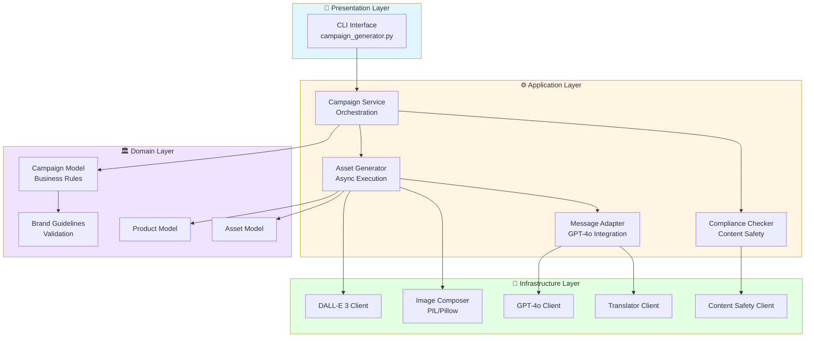
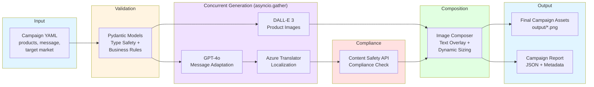
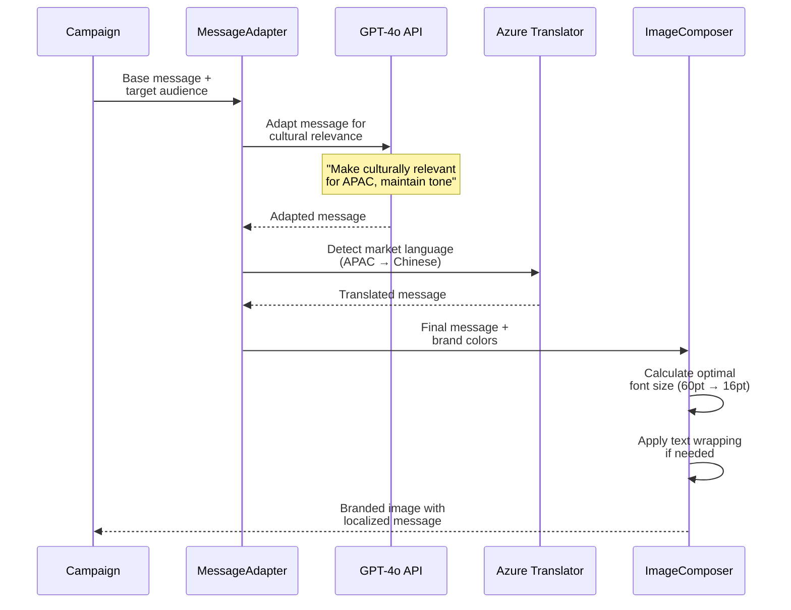
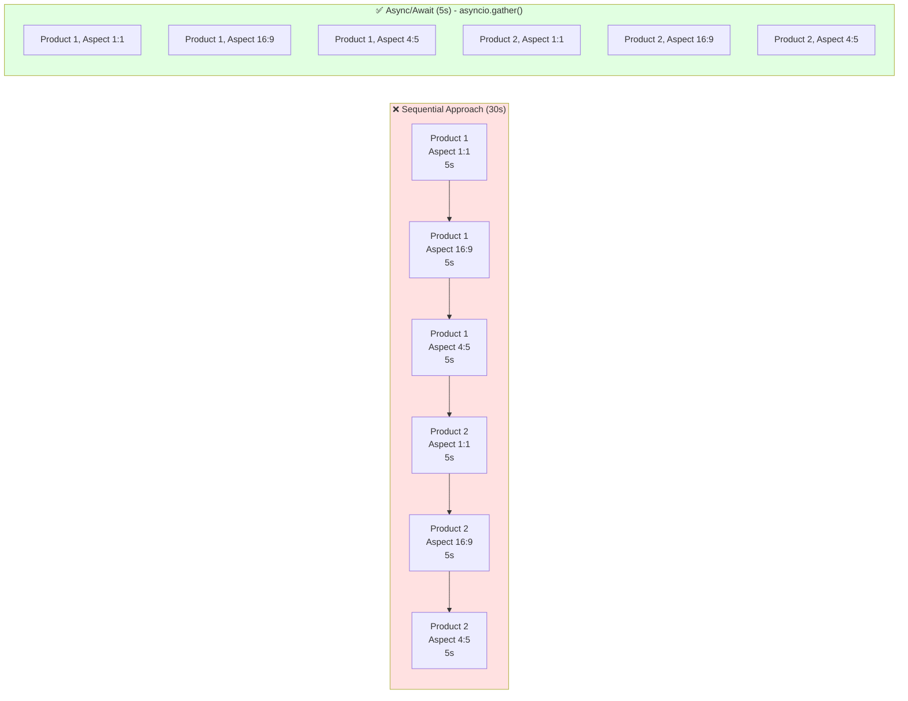
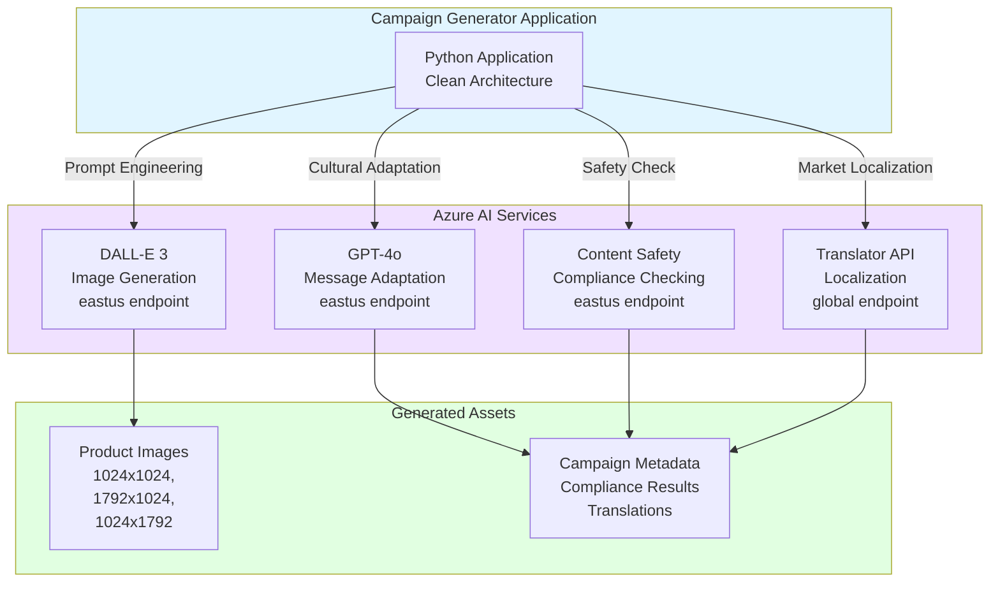

# Architecture Diagrams

This document provides visual representations of the system architecture, data flows, and integration patterns.

---

## System Architecture (Clean Architecture)



---

## Data Flow Pipeline



---

## Message Adaptation Pipeline



---

## Async Concurrency Model



**Performance**: 75% reduction in execution time (5s vs 30s for 6 images)

---

## Azure Services Integration



---

## Key Architecture Decisions

### Clean Architecture Benefits
1. **Domain Independence**: Business rules (Campaign, Product) don't depend on Azure APIs
2. **Testability**: Can mock infrastructure layer for fast unit tests
3. **Flexibility**: Can swap DALL-E for Midjourney without changing domain logic

### Async/Await Performance
- **Before**: Sequential image generation = 6 × 5s = 30s
- **After**: Concurrent with `asyncio.gather()` = max(5s) = 5s
- **Impact**: 75% reduction in execution time

### Type Safety with Pydantic
```python
# Domain model enforces business rules at the boundary
class Campaign(BaseModel):
    products: List[Product] = Field(min_length=2)  # ≥2 products required
    campaign_message: str = Field(min_length=10)   # ≥10 chars required
    brand_guidelines: BrandGuidelines              # Type-safe color validation
```

---

## Integration Points

| Component | Technology | Purpose | Performance |
|-----------|-----------|---------|-------------|
| **Image Generation** | DALL-E 3 | Professional product photography | 5s per image |
| **Message Adaptation** | GPT-4o | Cultural relevance | 1-2s per message |
| **Compliance** | Content Safety API | ML-powered safety checks | <1s per check |
| **Localization** | Azure Translator | Market-based translation | <1s per translation |
| **Composition** | PIL/Pillow | Image overlay + text fitting | <100ms per image |

**Total Pipeline**: ~5-7 seconds for 6 fully localized, compliant campaign assets

---

**Document Version**: 1.0
**Last Updated**: 2025-10-06
**Related Docs**: Technical-Approach.md, README.md
